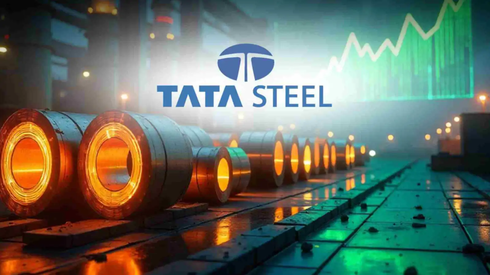

<div align="center">



# 🏭 TATA STEEL | AI-Powered Predictive Maintenance System


# 🚀 Smart Industrial Failure Prediction using Machine Learning

### AI-Powered Predictive Maintenance Dashboard for Industrial Equipment Monitoring

</div>

---

# 🌐 Live Demo

🔗 **Streamlit Live App**  
https://tata-steel-predictive-maintenance-of-motor-m6uki8xazyfvosnshaa.streamlit.app/

🔗 **GitHub Repository**  
https://github.com/muskansaini-08/Tata-Steel-Predictive-Maintenance-of-Motor

---

# 📖 About The Project

This project is an AI-powered Predictive Maintenance System developed for industrial machine monitoring and failure prediction inspired by real-world industrial environments like **TATA STEEL**.

The application uses Machine Learning algorithms to analyze machine operational parameters and predict whether a machine is at risk of failure or operating safely.

The goal of this system is to help industries:

✅ Reduce machine downtime  
✅ Prevent unexpected failures  
✅ Improve operational efficiency  
✅ Enable smart maintenance planning  
✅ Support Industry 4.0 transformation  

---

# 🧠 Problem Statement

Industries often suffer huge financial losses because of:

- Sudden machine breakdowns
- Unplanned maintenance
- Production downtime
- Equipment damage
- Inefficient maintenance scheduling

Traditional maintenance approaches are expensive and inefficient.

This project solves the problem using **Predictive Maintenance**, where AI predicts machine failures before they occur.

---

# ⚙️ Technologies Used

| Technology | Purpose |
|---|---|
| Python | Core Programming |
| Streamlit | Web Application |
| Pandas | Data Processing |
| NumPy | Numerical Computation |
| Matplotlib | Data Visualization |
| Scikit-learn | Machine Learning |
| Pickle | Model Deployment |

---

# 📂 Dataset Information

The system uses industrial machine data containing:

- Air Temperature
- Process Temperature
- Rotational Speed
- Torque
- Tool Wear
- Machine Type
- Failure Status

Dataset Used:

```bash
ai4i2020.csv
```

---

# 🏗️ Project Workflow

```text
Industrial Machine Data
          ↓
Data Preprocessing
          ↓
Feature Engineering
          ↓
Machine Learning Model
          ↓
Failure Prediction
          ↓
Streamlit Dashboard
```

---

# ✨ Features

## 📊 Smart Dashboard

- Real-time industrial monitoring
- Machine health analysis
- Failure statistics
- Operational insights

## 🤖 AI Failure Prediction

The model predicts:

✅ Safe Machine Condition  
⚠️ High Failure Risk  

## 📈 Interactive Visualizations

- Failure vs No Failure Analysis
- Machine Type Distribution
- Temperature Distribution
- Torque Distribution

## 🏭 Industrial UI Design

- TATA STEEL inspired interface
- Dark industrial dashboard
- Professional layout
- Interactive user controls

---

# 🖥️ Dashboard Includes

✅ Total Machine Count  
✅ Failure Count  
✅ Failure Rate  
✅ Machine Health Indicator  
✅ Prediction System  
✅ Data Visualization  
✅ Operational Insights  

---

# 🔍 Machine Learning Workflow

## Step 1 — Data Collection

Industrial machine sensor data is collected.

## Step 2 — Data Preprocessing

- Cleaning data
- Handling missing values
- Feature selection

## Step 3 — Model Training

Machine Learning model is trained using industrial data.

## Step 4 — Model Evaluation

Prediction accuracy and model performance are tested.

## Step 5 — Deployment

The trained model is deployed using Streamlit.

---

# 📂 Project Structure

```bash
📦 Tata-Steel-Predictive-Maintenance-of-Motor
│
├── app.py
├── best_model.pkl
├── ai4i2020.csv
├── tata_logo.png
├── requirements.txt
└── README.md
```

---

# ▶️ How To Run The Project

## 1️⃣ Clone Repository

```bash
git clone https://github.com/muskansaini-08/Tata-Steel-Predictive-Maintenance-of-Motor.git
```

---

## 2️⃣ Open Project Folder

```bash
cd Tata-Steel-Predictive-Maintenance-of-Motor
```

---

## 3️⃣ Install Dependencies

```bash
pip install -r requirements.txt
```

---

## 4️⃣ Run Streamlit App

```bash
streamlit run app.py
```

---

# 📊 Prediction Parameters

The AI model uses the following parameters:

| Parameter | Description |
|---|---|
| Air Temperature | Environmental temperature |
| Process Temperature | Machine process heat |
| Rotational Speed | RPM of machine |
| Torque | Rotational force |
| Tool Wear | Tool usage duration |
| Machine Type | Machine category |

---

# 🌐 Live Application Access

Experience the live industrial dashboard here:

🔗 https://tata-steel-predictive-maintenance-of-motor-m6uki8xazyfvosnshaa.streamlit.app/

---

# 🏭 Industrial Benefits

This system helps industries like TATA STEEL by:

✅ Reducing maintenance costs  
✅ Preventing unexpected machine failures  
✅ Increasing equipment lifespan  
✅ Improving production efficiency  
✅ Supporting smart manufacturing  

---

# 🚀 Future Enhancements

- IoT Sensor Integration
- Live Industrial Monitoring
- Cloud Deployment
- Real-time Alerts
- Deep Learning Models
- Mobile Dashboard

---

# 🛡️ Industry 4.0 Solution

This project represents a smart Industry 4.0 solution where Artificial Intelligence and Industrial Automation work together for intelligent predictive maintenance systems.

---

# 👩‍💻 Developed By

# Muskan Saini

Machine Learning & Data Science Enthusiast

🔗 GitHub Profile:  
https://github.com/muskansaini-08

---

# ⭐ Support

If you like this project, please give it a ⭐ on GitHub.

---

<div align="center">

# 🚀 TATA STEEL Predictive Maintenance System

### Smart Maintenance • Smart Industry • Smart Future

</div>
